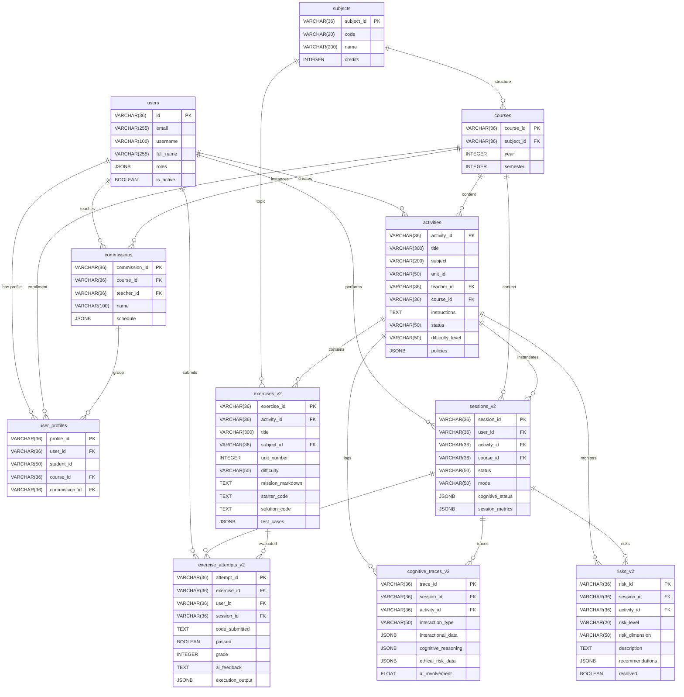

```mermaid
erDiagram
    %% Entities
    users {
        VARCHAR(36) id PK
        VARCHAR(255) email
        VARCHAR(100) username
        VARCHAR(255) full_name
        JSONB roles
        BOOLEAN is_active
    }

    user_profiles {
        VARCHAR(36) profile_id PK
        VARCHAR(36) user_id FK
        VARCHAR(50) student_id
        VARCHAR(36) course_id FK
        VARCHAR(36) commission_id FK
    }

    subjects {
        VARCHAR(36) subject_id PK
        VARCHAR(20) code
        VARCHAR(200) name
        INTEGER credits
    }

    courses {
        VARCHAR(36) course_id PK
        VARCHAR(36) subject_id FK
        INTEGER year
        INTEGER semester
    }

    commissions {
        VARCHAR(36) commission_id PK
        VARCHAR(36) course_id FK
        VARCHAR(36) teacher_id FK
        VARCHAR(100) name
        JSONB schedule
    }

    activities {
        VARCHAR(36) activity_id PK
        VARCHAR(300) title
        VARCHAR(200) subject
        VARCHAR(50) unit_id
        VARCHAR(36) teacher_id FK
        VARCHAR(36) course_id FK
        TEXT instructions
        VARCHAR(50) status
        VARCHAR(50) difficulty_level
        JSONB policies
    }

    sessions_v2 {
        VARCHAR(36) session_id PK
        VARCHAR(36) user_id FK
        VARCHAR(36) activity_id FK
        VARCHAR(36) course_id FK
        VARCHAR(50) status
        VARCHAR(50) mode
        JSONB cognitive_status
        JSONB session_metrics
    }

    exercises_v2 {
        VARCHAR(36) exercise_id PK
        VARCHAR(36) activity_id FK
        VARCHAR(300) title
        VARCHAR(36) subject_id FK
        INTEGER unit_number
        VARCHAR(50) difficulty
        TEXT mission_markdown
        TEXT starter_code
        TEXT solution_code
        JSONB test_cases
    }

    exercise_attempts_v2 {
        VARCHAR(36) attempt_id PK
        VARCHAR(36) exercise_id FK
        VARCHAR(36) user_id FK
        VARCHAR(36) session_id FK
        TEXT code_submitted
        BOOLEAN passed
        INTEGER grade
        TEXT ai_feedback
        JSONB execution_output
    }

    cognitive_traces_v2 {
        VARCHAR(36) trace_id PK
        VARCHAR(36) session_id FK
        VARCHAR(36) activity_id FK
        VARCHAR(50) interaction_type
        JSONB interactional_data
        JSONB cognitive_reasoning
        JSONB ethical_risk_data
        FLOAT ai_involvement
    }

    risks_v2 {
        VARCHAR(36) risk_id PK
        VARCHAR(36) session_id FK
        VARCHAR(36) activity_id FK
        VARCHAR(20) risk_level
        VARCHAR(50) risk_dimension
        TEXT description
        JSONB recommendations
        BOOLEAN resolved
    }

    %% Relationships
    users ||--o{ user_profiles : "has profile"
    users ||--o{ commissions : "teaches"
    users ||--o{ activities : "creates"
    users ||--o{ sessions_v2 : "performs"
    users ||--o{ exercise_attempts_v2 : "submits"

    subjects ||--o{ courses : "structure"
    subjects ||--o{ exercises_v2 : "topic"

    courses ||--o{ user_profiles : "enrollment"
    courses ||--o{ commissions : "instances"
    courses ||--o{ activities : "content"
    courses ||--o{ sessions_v2 : "context"

    commissions ||--o{ user_profiles : "group"

    activities ||--o{ sessions_v2 : "instantiates"
    activities ||--o{ exercises_v2 : "contains"
    activities ||--o{ cognitive_traces_v2 : "logs"
    activities ||--o{ risks_v2 : "monitors"

    sessions_v2 ||--o{ exercise_attempts_v2 : "attempts"
    sessions_v2 ||--o{ cognitive_traces_v2 : "traces"
    sessions_v2 ||--o{ risks_v2 : "risks"

    exercises_v2 ||--o{ exercise_attempts_v2 : "evaluated"
```
